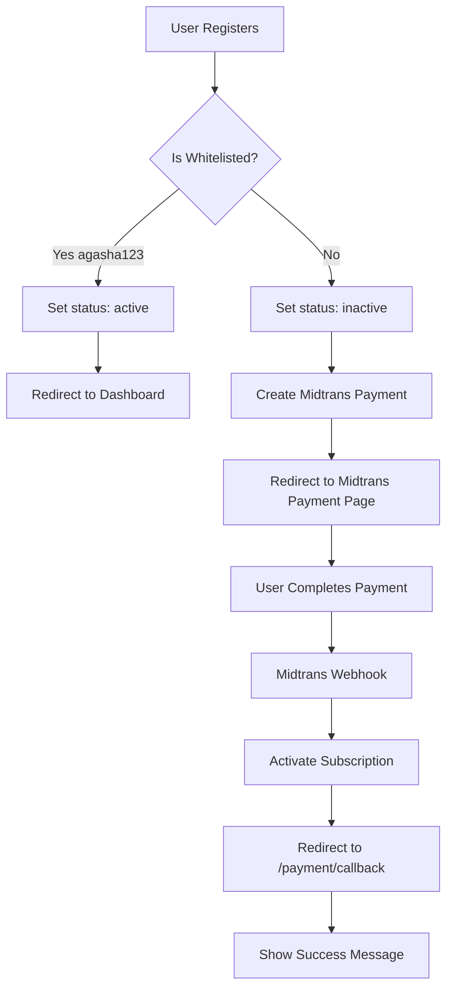
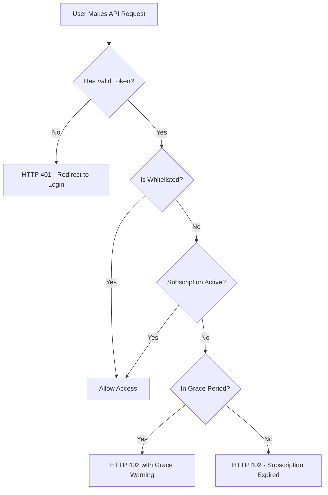

# Payment System Setup Guide

## ✅ Frontend Integration Complete

All payment system features have been integrated into the Vue.js frontend.

---

## What Was Implemented

### 1. **API Client Updates** ([src/api/client.js](src/api/client.js))
- Added HTTP 402 interceptor to catch subscription expiration errors
- Automatically redirects to subscription expired page when access is denied

### 2. **Auth Store Updates** ([src/stores/auth.js](src/stores/auth.js))
- Modified `register()` function to return full payment information
- Supports both whitelisted (free) and paid registration flows

### 3. **Registration Flow** ([src/views/RegisterView.vue](src/views/RegisterView.vue))
- Checks if payment is required after registration
- Redirects to Midtrans payment page for non-whitelisted users
- Allows whitelisted users (agasha123) to proceed directly

### 4. **Payment Callback Page** ([src/views/PaymentCallbackView.vue](src/views/PaymentCallbackView.vue))
- Verifies payment status after Midtrans payment
- Shows success/failure states
- Allows retry payment on failure

### 5. **Subscription Expired Page** ([src/views/SubscriptionExpiredView.vue](src/views/SubscriptionExpiredView.vue))
- Displayed when HTTP 402 error is received
- Allows users to renew their subscription
- Shows grace period warnings

### 6. **Subscription Status Component** ([src/components/SubscriptionStatus.vue](src/components/SubscriptionStatus.vue))
- Displays subscription status badge
- Shows renewal buttons for expired/grace period users
- Can be added to dashboard or header

### 7. **Router Updates** ([src/router/index.js](src/router/index.js))
- Added `/payment/callback` route
- Added `/subscription/expired` route

---

## Configuration Steps

### 1. Midtrans Dashboard Setup

1. Go to [Midtrans Dashboard](https://dashboard.sandbox.midtrans.com/) (or production dashboard)
2. Navigate to **Settings → Snap Preferences**
3. Configure redirect URLs:

```
Finish Redirect URL: https://your-frontend-url.com/payment/callback?order_id={order_id}
Unfinish Redirect URL: https://your-frontend-url.com/payment/callback?order_id={order_id}&status=unfinished
Error Redirect URL: https://your-frontend-url.com/payment/callback?order_id={order_id}&status=error
```

4. Navigate to **Settings → Configuration**
5. Add webhook URL:
```
https://flight-zone-exporter.onrender.com/api/payments/webhook
```

### 2. Render.com Backend Setup

#### Add Cron Job for Subscription Checker

**Option A: Via Render Dashboard**
1. Go to your Render dashboard
2. Click **"New +"** → **"Cron Job"**
3. Configure:
   - **Name**: `subscription-checker`
   - **Environment**: `Python`
   - **Schedule**: `0 0 * * *` (daily at midnight UTC)
   - **Build Command**: `pip install -r requirements.txt`
   - **Command**:
     ```bash
     python -c "from app.tasks.subscription_checker import update_expired_subscriptions; result = update_expired_subscriptions(); print(result)"
     ```
4. Add all environment variables (same as your web service)
5. Click **"Create Cron Job"**

**Option B: Via render.yaml** (if you have one)
```yaml
services:
  - type: web
    name: flight-zone-exporter
    env: python
    buildCommand: pip install -r requirements.txt
    startCommand: uvicorn app.main:app --host 0.0.0.0 --port $PORT

  - type: cron
    name: subscription-checker
    env: python
    schedule: "0 0 * * *"
    buildCommand: pip install -r requirements.txt
    startCommand: python -c "from app.tasks.subscription_checker import update_expired_subscriptions; result = update_expired_subscriptions(); print(result)"
```

---

## Testing the Implementation

### Test 1: Whitelisted User (agasha123)
1. Register with username: `agasha123`
2. **Expected**: Redirected to dashboard immediately (no payment required)
3. **Check**: User has subscription status "active" with plan_type "free"

### Test 2: Regular User (Paid)
1. Register with any other username
2. **Expected**: Redirected to Midtrans payment page
3. Complete payment in Midtrans sandbox
4. **Expected**: Redirected to `/payment/callback` with success message
5. **Check**: User has subscription status "active" with plan_type "monthly"

### Test 3: Subscription Expiration
1. Manually update a user's `subscription_end_date` to a past date
2. Try to access any protected endpoint
3. **Expected**: Redirected to `/subscription/expired` with error message

### Test 4: Grace Period
1. Set user's `subscription_status` to "grace_period"
2. Set `subscription_end_date` to 2 days ago
3. Try to access protected endpoint
4. **Expected**: HTTP 402 error with "X days left in grace period" message

---

## How the Payment Flow Works

### Registration Flow



### Access Control Flow



---

## Adding Subscription Status to Your Dashboard

You can display the subscription status in your dashboard/header by importing the component:

```vue
<template>
  <div class="header">
    <h1>Flight Zone Exporter</h1>

    <!-- Add subscription status -->
    <SubscriptionStatus />
  </div>
</template>

<script setup>
import SubscriptionStatus from '@/components/SubscriptionStatus.vue'
</script>
```

---

## API Endpoints Reference

### Payment Endpoints
- `POST /api/payments/create` - Create new payment (requires auth)
- `GET /api/payments/{payment_id}/status` - Check payment status
- `POST /api/payments/webhook` - Midtrans webhook (public)

### Subscription Endpoints
- `GET /api/subscriptions/status` - Get current subscription status
- `GET /api/subscriptions/history` - Get subscription history

---

## Environment Variables

### Backend (.env)
```bash
MIDTRANS_IS_PRODUCTION=false
MIDTRANS_SERVER_KEY=SB-Mid-server-vbHVLOOTdUsat7D3thUsrBGx
MIDTRANS_CLIENT_KEY=SB-Mid-client-_wlfBv2oixD5wtrv
MIDTRANS_MERCHANT_ID=G162653928
MONTHLY_SUBSCRIPTION_PRICE=4000000
SUBSCRIPTION_GRACE_PERIOD_DAYS=3
```

### Frontend (.env)
```bash
VITE_API_URL=https://flight-zone-exporter.onrender.com
```

---

## Production Deployment Checklist

- [ ] Update Midtrans to production credentials in backend .env
- [ ] Update Midtrans redirect URLs to production frontend URL
- [ ] Configure Midtrans webhook URL to production backend
- [ ] Set up Render cron job for subscription checker
- [ ] Test complete registration → payment → access flow
- [ ] Test subscription expiration and renewal
- [ ] Monitor webhook logs in Midtrans dashboard

---

## Troubleshooting

### Payment Not Activating After Success
1. Check Midtrans webhook logs in dashboard
2. Check backend logs on Render for webhook endpoint
3. Verify signature validation is working
4. Manually check payment status via API

### HTTP 402 Errors
1. Check user's subscription_end_date in Firestore
2. Verify subscription_status field
3. Check if user is whitelisted
4. Run subscription checker manually

### Redirect URL Not Working
1. Verify URLs in Midtrans dashboard match your frontend
2. Check for trailing slashes
3. Ensure {order_id} placeholder is included

---

## Support

- **Midtrans Documentation**: https://docs.midtrans.com/
- **Backend API**: https://flight-zone-exporter.onrender.com/docs
- **Subscription Price**: Rp 4,000,000/month
- **Grace Period**: 3 days
